# Dual Trading Bot Architecture

2026-02-07 08:02

Status: active

Tags: [[3 - Tags/trading|trading]] [[3 - Tags/architecture|architecture]] [[3 - Tags/mission-control|mission-control]]

## Overview

This document describes the architecture for running two independent trading bots while maintaining unified Mission Control visibility and enabling safe strategy iteration.

## System Architecture

```mermaid
flowchart TB
    subgraph Exchanges["🏦 Exchanges"]
        CB[Coinbase<br/>Spot Trading]
        KR[Kraken<br/>Margin/Futures]
    end
    
    subgraph Bots["🤖 Trading Bots"]
        BOT1[Bot 1: Long Only<br/>coinbase_bot/]
        BOT2[Bot 2: Leveraged<br/>kraken_bot/]
    end
    
    subgraph Strategies["📊 Strategy Layer"]
        PROD[Production Strategies<br/>strategies/production/]
        DEV[Development Strategies<br/>strategies/development/]
        BACK[Backtest Engine<br/>backtest/]
    end
    
    subgraph Sync["🔄 Sync Layer"]
        SYNC[sync_to_mission_control.py<br/>Runs every 30 min via cron]
    end
    
    subgraph MC["🎯 Mission Control"]
        API[/api/trade]
        DASH[Trade Dashboard]
    end
    
    BOT1 --> CB
    BOT2 --> KR
    
    BOT1 -.->|imports| PROD
    BOT2 -.->|imports| PROD
    
    DEV -->|promote when ready| PROD
    BACK -->|validate| DEV
    
    CB -->|balances, trades| SYNC
    KR -->|balances, trades| SYNC
    BOT1 -->|state, signals| SYNC
    BOT2 -->|state, signals| SYNC
    
    SYNC -->|POST| API
    API --> DASH
```

## Directory Structure

```
simple_trader/
├── coinbase_bot/              # Bot 1: Long-only spot trading
│   ├── run.py                 # Entry point
│   ├── config.yaml            # Bot-specific config
│   ├── state.json             # Persisted state
│   └── logs/
│
├── kraken_bot/                # Bot 2: Leveraged/short trading
│   ├── run.py
│   ├── config.yaml
│   ├── state.json
│   └── logs/
│
├── strategies/
│   ├── production/            # LIVE strategies (bots import from here)
│   │   ├── sma_crossover.py
│   │   ├── rsi_momentum.py
│   │   └── config.yaml        # Production parameters
│   │
│   └── development/           # TESTING strategies (never auto-deployed)
│       ├── enhanced_v2.py
│       └── experimental/
│
├── backtest/                  # Isolated backtesting
│   ├── run_backtest.py
│   ├── results/
│   └── plots/
│
├── sync_to_mission_control.py # Unified sync for both bots
└── shared/                    # Common utilities
    ├── coinbase.py
    ├── kraken.py
    └── indicators.py
```

## Bot Isolation

Each bot runs as an independent process with its own:

| Component | Bot 1 (Coinbase) | Bot 2 (Kraken) |
|-----------|------------------|----------------|
| Exchange | Coinbase (spot) | Kraken (margin) |
| Mode | Long only | Long + Short |
| Leverage | 1x | Up to 3x |
| Process | `coinbase_bot/run.py` | `kraken_bot/run.py` |
| State file | `coinbase_bot/state.json` | `kraken_bot/state.json` |
| Log file | `coinbase_bot/logs/` | `kraken_bot/logs/` |


## Strategy Development Flow

Safe iteration without disrupting live bots:

```mermaid
flowchart TD
    A[1️⃣ Develop] -->|strategies/development/| B[2️⃣ Backtest]
    B -->|run_backtest.py| C{Results OK?}
    C -->|No| A
    C -->|Yes| D[3️⃣ Paper Trade]
    D -->|dry_run=true| E{Paper OK?}
    E -->|No| A
    E -->|Yes| F[4️⃣ Promote]
    F -->|copy to production/| G[5️⃣ Bot Restart]
    G -->|graceful| H[✅ Live]
    
    style A fill:#e1f5fe
    style B fill:#fff3e0
    style D fill:#f3e5f5
    style F fill:#e8f5e9
    style H fill:#c8e6c9
```



### Steps

1. **Develop** - Write new strategy in `strategies/development/`
2. **Backtest** - Run historical tests, compare to baseline
3. **Paper Trade** - Run bot with `dry_run=true` for 24-48hrs
4. **Promote** - Copy to `strategies/production/` when satisfied
5. **Restart** - Gracefully restart the target bot

### Key Rule
> **Bots ONLY import from `strategies/production/`**
> 
> Development work never affects live trading until explicitly promoted.

## Mission Control Sync

Single sync script aggregates data from both bots:

```python
# sync_to_mission_control.py

def sync():
    # Aggregate from both bots
    coinbase_data = read_bot_state("coinbase_bot/")
    kraken_data = read_bot_state("kraken_bot/")
    
    # Fetch live balances
    coinbase_balances = get_coinbase_balances()
    kraken_balances = get_kraken_balances()
    
    # Build unified payload
    payload = {
        "bots": [
            {
                "name": "Long Only",
                "exchange": "coinbase",
                "portfolio_value": coinbase_balances["USD"],
                "position": coinbase_data["position"],
                "signal": coinbase_data["last_signal"],
                "pnl_24h": coinbase_data["pnl_24h"]
            },
            {
                "name": "Leveraged",
                "exchange": "kraken", 
                "portfolio_value": kraken_balances["USD"],
                "position": kraken_data["position"],
                "signal": kraken_data["last_signal"],
                "pnl_24h": kraken_data["pnl_24h"]
            }
        ],
        "strategies": load_backtest_results(),
        "last_sync": datetime.utcnow().isoformat()
    }
    
    requests.post(MISSION_CONTROL_URL, json=payload)
```

## Cron Jobs

```yaml
# Trader Sync - Every 30 min
- id: trader-sync
  schedule: "*/30 * * * *"
  text: "Sync trader data from BOTH exchanges to Mission Control"
  wakeMode: now

# Bot Health Check - Every 5 min
- id: bot-health
  schedule: "*/5 * * * *"
  text: "Check both trading bots are running, alert if down"
  wakeMode: now
```

## Graceful Restart Protocol

When updating a bot or its strategy:

```bash
# 1. Signal graceful shutdown
kill -SIGTERM $(cat coinbase_bot/bot.pid)

# 2. Wait for current trade cycle to complete (max 60s)
# Bot saves state to state.json before exit

# 3. Start new version
cd coinbase_bot && python run.py &

# 4. Verify health
sleep 10 && curl localhost:8081/health
```

## Configuration

Each bot has its own `config.yaml`:

```yaml
# coinbase_bot/config.yaml
exchange: coinbase
mode: long_only
strategy: sma_crossover
parameters:
  fast_period: 20
  slow_period: 50
  
trading:
  pairs: ["BTC-USD", "ETH-USD", "LTC-USD"]
  trade_amount_usd: 50
  max_position_pct: 0.25
  
risk:
  stop_loss_pct: 0.05
  take_profit_pct: 0.10
  max_drawdown_pct: 0.15
  
dry_run: false
```

## Safety Features

1. **Process isolation** - One bot crashing doesn't affect the other
2. **State persistence** - Bots resume correctly after restart
3. **Strategy separation** - Development never touches production
4. **Health monitoring** - Cron job alerts if bot is down
5. **Graceful shutdown** - Complete current cycle before exit
6. **Position limits** - Max allocation per asset enforced

## Implementation Status

| Component | Status | Notes |
|-----------|--------|-------|
| Coinbase bot | ✅ Running | Current `run.py` |
| Kraken bot | 🔧 Scaffolded | `kraken.py` + `kraken_strategy.py` exist |
| Strategy separation | ⏳ TODO | Currently mixed in `trader/` |
| Unified sync | ✅ Working | `sync_to_mission_control.py` |
| Mission Control API | ✅ Live | `/api/trade` endpoint |
| Health check cron | ⏳ TODO | Need to add |

## Next Steps

1. **Restructure directories** - Move to clean separation above
2. **Create bot configs** - Individual `config.yaml` per bot
3. **Implement Kraken bot** - Wire up margin trading
4. **Add health check** - Cron job for bot monitoring
5. **Update MC dashboard** - Show both bots side-by-side

---

## References
- [[simple_trader README]]
- [[Mission Control Trade API]]
- https://github.com/carygeo/mission-control
